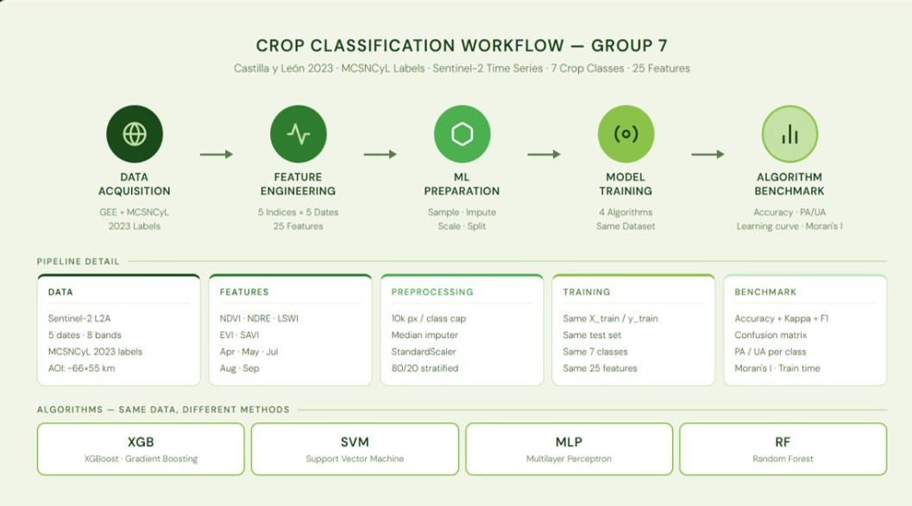
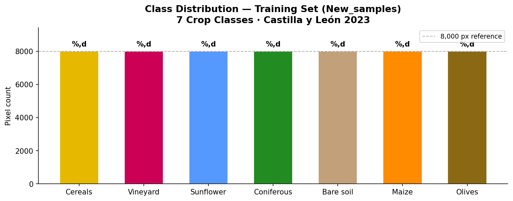
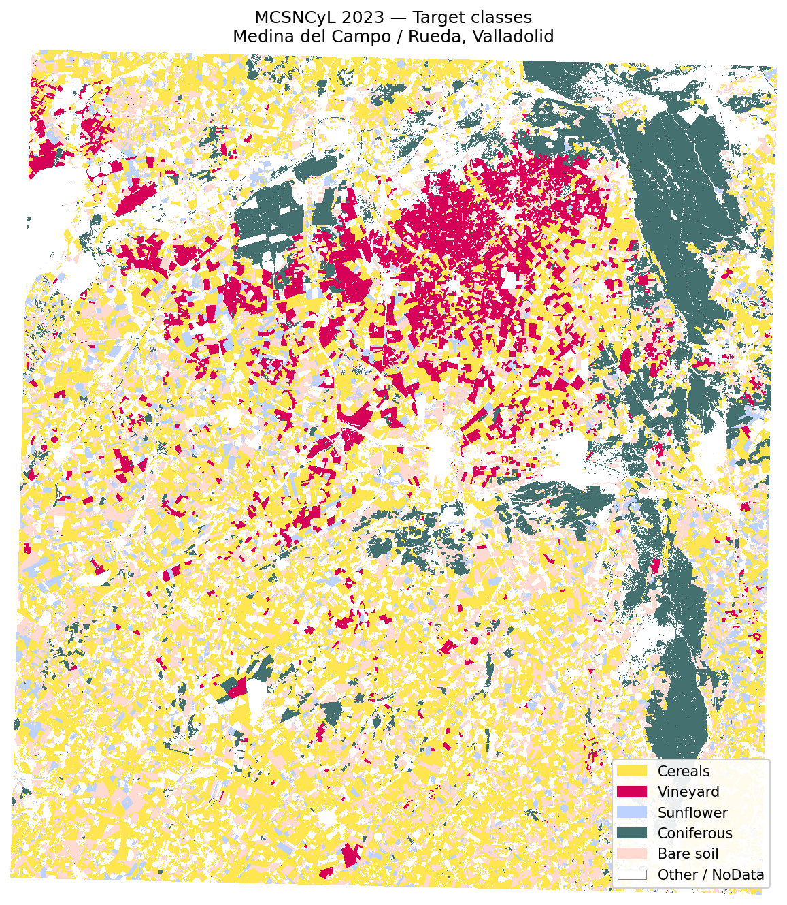
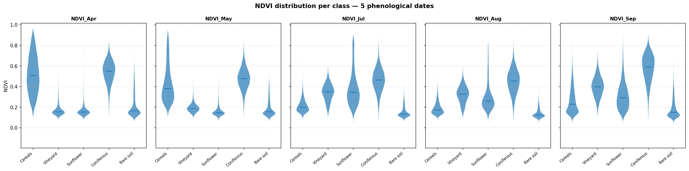
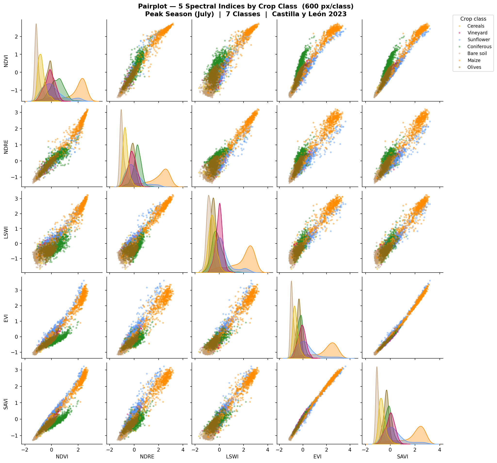
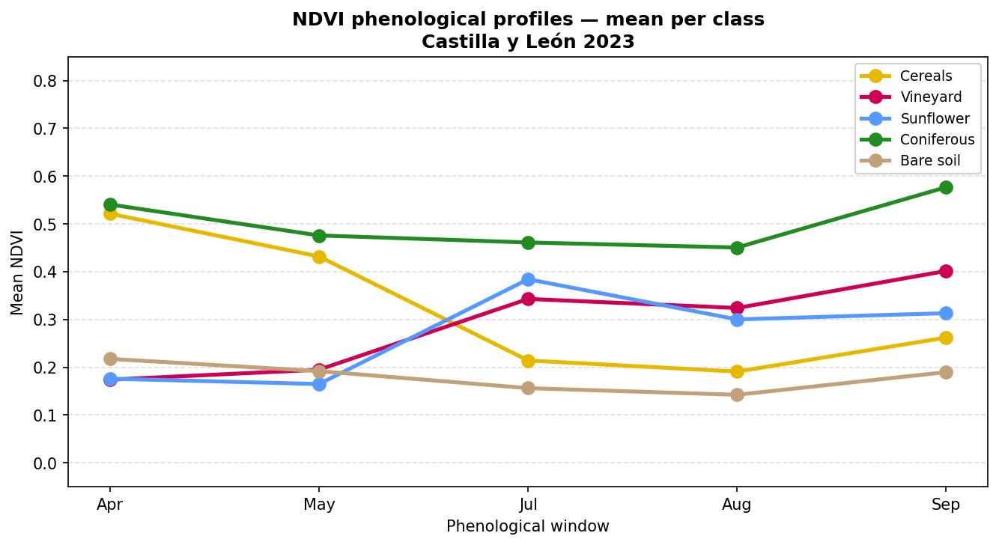
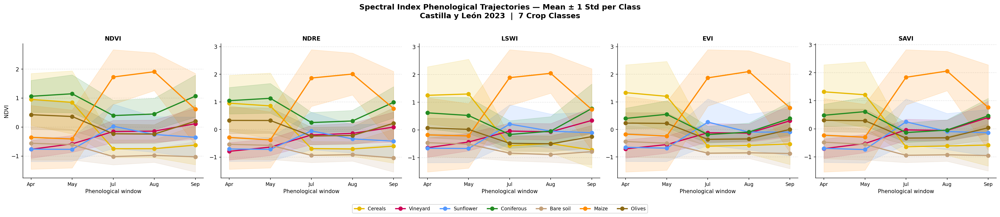

# Crop Health Monitoring using Different ML Algorithms

Crop classification over **Castilla y León, Spain (2023)** using multi-temporal Sentinel-2 imagery and supervised machine learning.  
Study area: Medina del Campo / Rueda, Valladolid province (~50 × 50 km, Tile 30TUN).

---

## Workflow



---

## Data Sources

| Source | Description |
|--------|-------------|
| **MCSNCyL 2023** (ITACyL) | Raster crop map — ground-truth labels |
| **Sentinel-2 L2A** (GEE) | 5 phenological dates: Apr · May · Jul · Aug · Sep |
| **AOI** | Shapefile clipping to ~50 × 50 km study area |

**7 Crop Classes:** Cereals · Vineyard · Sunflower · Coniferous · Bare Soil · Maize · Olives

**5 Spectral Indices per date:** NDVI · NDRE · LSWI · EVI · SAVI → **25 features total**

---

## Results

### Class Distribution & Label Map

<p float="left">
  
  
</p>

---

### Feature Distributions per Class

<p float="left">
  
  
</p>

---

### Phenological Profiles

<p float="left">
  
  
</p>

---

## Project Structure

```
├── Data/
│   ├── X_train.npy / X_test.npy        # Train & test feature arrays
│   ├── metadata.pkl                     # Class names & feature names
│   ├── mcsncyl_2023_aoi.tif            # Clipped label raster
│   ├── satellite images/               # Sentinel-2 GEE exports (Apr–Sep)
│   ├── AOI/                            # Area of interest shapefile
│   └── train_test/                     # Scaled arrays for model input
├── src/
│   ├── ML_Group_Script_updated.ipynb   # Data prep pipeline (run on Google Colab)
│   └── svm_crop_classification_timeseries.ipynb  # SVM classifier
├── figuers/                            # Output plots & figures
├── literature/                         # Reference papers
└── requirements.txt
```

---

## Notebooks

### `ML_Group_Script_updated.ipynb`
> Run on **Google Colab**

Main data preparation pipeline:
- Loads MCSNCyL label raster and Sentinel-2 GEE exports
- Clips data to AOI, aligns rasters, computes spectral indices
- Samples pixels per class, splits into train/test sets
- **Output:** `X_train.npy`, `X_test.npy`, `y_train`, `y_test`, `metadata.pkl`

### `svm_crop_classification_timeseries.ipynb`
SVM classification using 25 time-series features:
- Compares unscaled vs scaled input
- Grid-search hyperparameter tuning (C, gamma)
- Feature engineering (temporal differences, cross-index ratios)
- Produces classification map over reduced study area

> **Note:** The classification map uses a reduced spatial extent — the full Castilla y León raster is too large for SVM pixel-by-pixel inference in reasonable time.

---

## Setup

```bash
pip install -r requirements.txt
```

---

## Team

Group project — ITC Masters, Q3 Machine Learning Assignment.  
Branches: `Mo` · `Anisha` · `Miren` · `Zillah`
